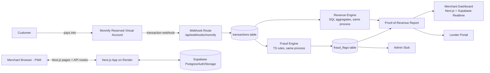

# PROOFR — Architecture

Expands the [PRD's High-Level Architecture line](PROOFR_MVP_PRD.md#high-level-architecture) with the actual stack decided for this build.

## System diagram

## Deploy topology

- **One Render web service** hosting the Next.js app (frontend pages + API routes/Route Handlers). Deployed from day one so Monnify has a stable HTTPS webhook target — no local-only dev, no ngrok dependency mid-build.
- **One Supabase project** providing Postgres, Auth, and Storage (for report files/exports if needed).
- **Monnify sandbox** as the only external payment dependency: reserved account issuance API (called from milestone 4) + transaction webhook (received at milestone 5).

### Required env vars

| Var | Purpose |
|---|---|
| `MONNIFY_API_KEY` / `MONNIFY_SECRET_KEY` | Authenticate Monnify API calls |
| `MONNIFY_CONTRACT_CODE` | Required for reserved account creation |
| `MONNIFY_WEBHOOK_SECRET` | Scaffolded but unused — Monnify signs webhooks with `MONNIFY_SECRET_KEY`, not a separate secret. See handoff.md milestone 5. |
| `NEXT_PUBLIC_SUPABASE_URL` / `NEXT_PUBLIC_SUPABASE_ANON_KEY` | Client-side Supabase access (RLS-scoped) |
| `SUPABASE_SERVICE_ROLE_KEY` | Server-side only: webhook ingestion, fraud engine, admin overrides |

## Why a monolith, not separate backend/frontend

Next.js API routes serve as the entire backend: webhook receiver, revenue engine, fraud rules, and report generation all live in `/app/api/*` and call Supabase directly. One repo, one deploy, no CORS/token plumbing between two services — not worth the coordination cost on a 2-day build. Split into a separate service only if a future phase needs long-running background jobs beyond what the Render web service or Supabase Edge Functions/cron can handle.

## Why the fraud engine is TypeScript, not Python

The PRD's fraud rules (circular transfers, self-funding, excessive identical transfers, velocity spikes — see [fraud-rules.md](fraud-rules.md)) are deterministic pattern checks over transaction records, not statistical/ML models. They're expressed as SQL window functions or JS logic over query results, so there's no need for a Python/ML stack or a second language boundary to debug under time pressure. Revisit only if a future phase adds an actual ML-based credit score.
