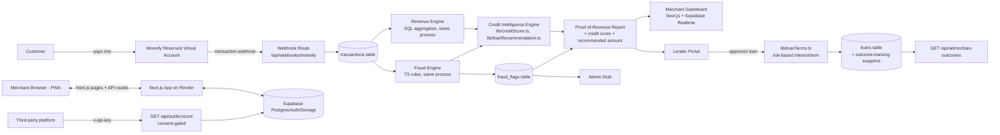

# PROOFR — Architecture

Expands the [PRD's High-Level Architecture line](PROOFR_MVP_PRD.md#high-level-architecture) with the actual stack decided for this build.

## System diagram

The credit intelligence engine (`lib/creditScore.ts`, `lib/loanRecommendation.ts`, `lib/loanTerms.ts`, milestones 17/19/20) and the public API (`GET /api/public/score`, milestones 22/23) are additive layers on top of the pipeline above — no new external service dependency, same Supabase project, same Next.js monolith. Full detail in [credit-intelligence-engine.md](credit-intelligence-engine.md), not repeated here.

## Deploy topology

- **One Render web service** hosting the Next.js app (frontend pages + API routes/Route Handlers). Deployed from day one so Monnify has a stable HTTPS webhook target — no local-only dev, no ngrok dependency mid-build.
- **One Supabase project** providing Postgres, Auth, and Storage (for report files/exports if needed).
- **Monnify sandbox** as the only external payment dependency: reserved account issuance API (called from milestone 4) + transaction webhook (received at milestone 5).

### Required env vars

| Var | Purpose |
|---|---|
| `MONNIFY_API_KEY` / `MONNIFY_SECRET_KEY` | Authenticate Monnify API calls |
| `MONNIFY_CONTRACT_CODE` | Required for reserved account creation |
| `MONNIFY_WEBHOOK_SECRET` | Scaffolded but unused — Monnify signs webhooks with `MONNIFY_SECRET_KEY`, not a separate secret. See handoff.md milestone 5. |
| `NEXT_PUBLIC_SUPABASE_URL` / `NEXT_PUBLIC_SUPABASE_ANON_KEY` | Client-side Supabase access (RLS-scoped) |
| `SUPABASE_SERVICE_ROLE_KEY` | Server-side only: webhook ingestion, fraud engine, admin overrides |
| `ADMIN_API_SECRET` | Shared-secret gate for `/api/admin/*` routes and `POST /api/merchants/:id/approve` — not real admin auth, see `handoff.md` milestone 2/14 |

**No new env vars were needed for the credit intelligence engine or the public API** (milestones 17–23) — everything reuses the existing Supabase project. The public API's `api_clients.api_key_hash` values are generated and stored via `scripts/provision-api-client.ts`, not an env var.

## Why a monolith, not separate backend/frontend

Next.js API routes serve as the entire backend: webhook receiver, revenue engine, fraud rules, and report generation all live in `/app/api/*` and call Supabase directly. One repo, one deploy, no CORS/token plumbing between two services — not worth the coordination cost on a 2-day build. Split into a separate service only if a future phase needs long-running background jobs beyond what the Render web service or Supabase Edge Functions/cron can handle.

## Why the fraud engine — and the credit scoring engine — are TypeScript, not Python/ML

The PRD's fraud rules (circular transfers, self-funding, excessive identical transfers, velocity spikes — see [fraud-rules.md](fraud-rules.md)) are deterministic pattern checks over transaction records, not statistical/ML models. They're expressed as SQL window functions or JS logic over query results, so there's no need for a Python/ML stack or a second language boundary to debug under time pressure.

Milestones 17–20 did add an actual credit score, loan recommendation, and risk-based loan terms — the future phase this note originally flagged — but they're still deterministic, component-scored TypeScript (`lib/creditScore.ts`, `lib/loanRecommendation.ts`, `lib/loanTerms.ts`), not an ML model. This was deliberate, not a shortcut: no real repayment-outcome data exists yet to train or validate a model against (every loan is still `lib/repayment.ts`'s simulated deduction — see milestone 21's outcome-tracking infrastructure, which is what a real model would eventually need). A transparent, inspectable formula a lender can see the reasoning for beats an opaque model with nothing real behind it yet. Revisit this decision once real repayment-outcome data exists to actually calibrate against — see [credit-intelligence-engine.md](credit-intelligence-engine.md)'s non-goals section.
